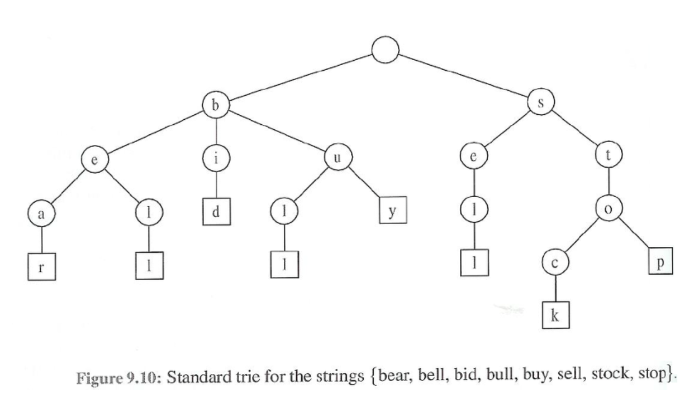

## 트라이(Trie)

\*\*\* 등장 배경

- 이진 탐색 트리로 정수를 탐색 시 시간 복잡도는?

  => O(logN) 으로 매우 효율적.

  단, 길이 M의 문자열 검색 시에는?

  => O(M*logN)

- 문자열 탐색에 효율적인 자료구조를 위해 트라이가 고안됨

  => 시간 복잡도 : O(M)

- 예제 : 백준 5052 - 전화번호 목록