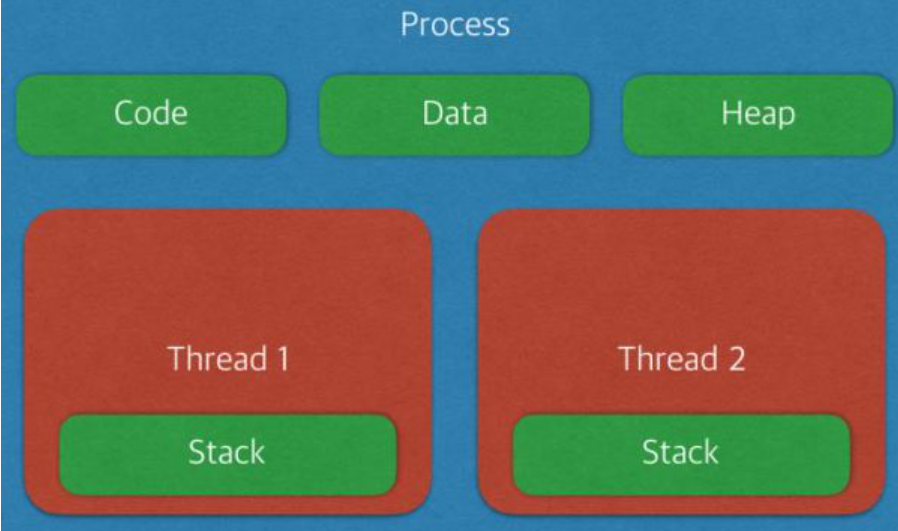
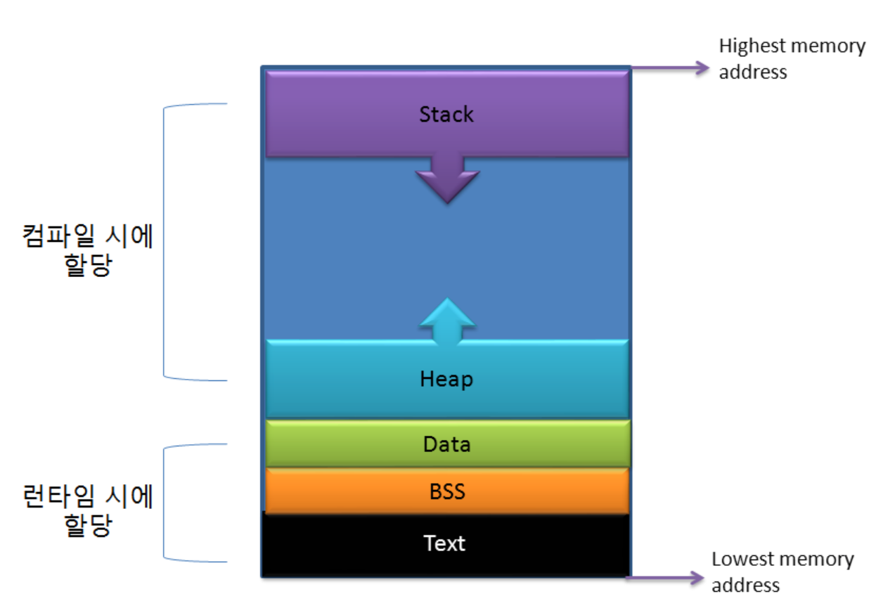

## 프로세스 & 스레드

- 프로세스 : 메모리에 적재되어 실행중인 프로그램

  스레드 : 프로세스 안에서 실행되는 실제 작업 흐름 단위

#### \# 프로세스 메모리 구조

##### 코드 영역

- 프로그램의 코드 본문이 저장되는 영역 => 읽기 전용(수정 불가)

##### Data & BSS

- 프로그램 실행 시 생성, 종료 시 시스템에 반환

- 전역변수, 정적변수, 배열, 구조체 등이 저장

- 초기화 된 데이터 => Data

  초기화 되지 않은 데이터 => BSS(Block Stated Symbol)

> Tip. ***Data, BSS 공간 구분 이유?***
>
> 초기화 되지 않은 데이터까지 저장 비용이 큰 매체에 저장하면 비효율적이므로,
>
> 초기화 되지 않은 데이터는 따로 저장하기 위해 공간을 구분하는 것

##### Heap

- 메모리를 동적으로 할당하고자 할 때 쓰는 영역 => <u>동적 데이터 영역</u>
- 메모리 주소 값에 의해 참조되고 사용되는 영역 ( new(), malloc() 등 )

##### Stack

- 지역변수, 매개변수, 리턴 값이 저장되는 영역 => <u>임시 메모리 영역</u>

> Tip.
>
> - Code, Data, BSS 영역은 컴파일 시 크기가 결정
>
>   Heap, Stack영역은 런타임 시 크기가 결정
>
> - Heap, Stack 영역 크기는 가변적
>
>   => Heap은 낮은 주소 부터 채워가고,
>
>   ​      Stack은 높은 주소 부터 채워간다
>
>   ​      => Heap이 넘치면 Heap overflow
>
>   ​           Stack이 넘치면 Stack overflow

##### 프로세스는 자신만의 고유 공간, 자원을 할당받아 사용

##### But, 스레드는 다른 스레드와 공간, 자원을 공유하면서 사용 ( Stack 만 따로 할당 받음 )

#### 멀티 프로세스?

- 하나의 컴퓨터에 여러 CPU 장착

  => 하나 이상의 프로세스들을 동시에 처리

  - 장점

    : 안전성이 높음

  - 단점

    : 각각 독립된 메모리 영역 => 작업량 많을수록 오버헤드 발생, 잦은 문맥 교환으로 인한 성능 저하

#### 멀티 스레드?

- 하나의 응용 프로그램에서 여러 스레드를 가짐

  => 스레드들이 공유 메모리를 통해 다수의 작업을 동시에 처리

  - 장점

    : 독립적인 프로세스에 비해 공유 메모리 만큼의 시간, 자원 손실이 감소

      => 전역 / 정적 변수에 대한 자료 공유 가능

  - 단점

    : 안전성 문제

      => 하나의 스레드가 데이터 공간을 망가뜨리면, 모든 스레드에 영향이 미침

    ​		=> <u>Critical Section 기법을 통해 대비</u>